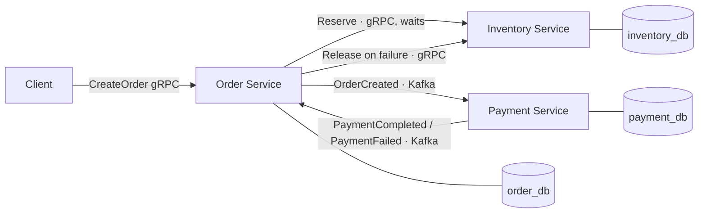

# Order Processing System

A distributed order-processing system built with Go microservices, demonstrating
synchronous (gRPC) and asynchronous (Kafka) service communication, correct behavior
under concurrency, and saga-based consistency with idempotent, crash-safe event handling.

Originally built to manage inventory and sales for a university CCA merchandise store
(charging cables, card holders, team badges), scoped down to a focused example of the
patterns that matter in high-throughput backend systems.

## What it does

A customer places an order. Behind the scenes, three independent services coordinate to
reserve stock, take payment, and confirm (or cancel) the order — communicating over gRPC
for the synchronous critical path and Kafka for asynchronous, retryable work.



- **Synchronous (gRPC):** Order → Inventory reserve. The order cannot be accepted without
  confirming stock exists *now*, so this call blocks on an immediate yes/no.
- **Asynchronous (Kafka):** Order → Payment and back. Payment is slow and retryable, so it
  runs off the request path; Kafka buffers and redelivers if Payment is unavailable.

## Services

| Service | Role | Communication | Storage |
|---------|------|---------------|---------|
| **Order** | Public entrypoint; orchestrates the saga | gRPC server + Kafka producer/consumer | `order_db` (MySQL) |
| **Inventory** | Stock reservation and release | gRPC server | `inventory_db` (MySQL) |
| **Payment** | Mock charge processing | Kafka consumer/producer | `payment_db` (MySQL) |

Each service owns its own database — no service reads another's tables, communication is
only via gRPC or Kafka events.

## Tech stack

- **Go** — all three services
- **gRPC + Protocol Buffers** — synchronous inter-service calls and the public API
- **Apache Kafka** — asynchronous event messaging (at-least-once delivery)
- **MySQL 8** — per-service persistence, accessed with `database/sql`
- **Redis** — available for caching (planned, see Roadmap)
- **Docker Compose** — local infrastructure (MySQL, Kafka, Redis)
- **golang-migrate** — schema migrations
- **ULID** — sortable, unique order identifiers

## Key design decisions

The interesting engineering is in *how* correctness is guaranteed. Each decision below was
made deliberately and is defensible against its alternatives.

### 1. Coordination: orchestration for the critical path

The Order service orchestrates the saga (reserve → charge → confirm) rather than using pure
event choreography. Each step is a *precondition* that gates order validity, and centralizing
the flow keeps the compensation logic auditable in one place. Choreography would suit
post-confirmation *reactions* (email, analytics) that don't gate the order — a natural future
extension — but the current scope is entirely critical path, so orchestration is the right fit.

### 2. Concurrency control: pessimistic row locking

Inventory reservation uses `SELECT ... FOR UPDATE` inside a transaction to lock stock rows
while checking and decrementing. Rows are locked in a deterministic order (sorted by product
ID) to prevent deadlocks between orders reserving the same SKUs in different sequences. This
prevents overselling when many orders hit the same SKU simultaneously.

*Proven by test:* 100 goroutines race for 10 units of stock; exactly 10 reservations succeed
and final stock lands at 0, verified under Go's race detector (`-race`).

### 3. Idempotency: primary-key deduplication

Because Kafka delivers at-least-once, a redelivered event must not double-charge or
double-reserve. Rather than adding bespoke deduplication machinery, the system leans on
existing database constraints:

- **Inventory** — the reservation row is inserted *before* the stock decrement; a duplicate-key
  violation on the `(order_id, product_id)` primary key (MySQL error 1062) is treated as
  "already reserved," skipping the decrement. Idempotency becomes a property of the schema.
- **Payment** — a redelivered `OrderCreated` collides on the `payments` primary key; the stored
  outcome is looked up and republished rather than charging again.
- **Order** — payment results are applied with a conditional `UPDATE ... WHERE status = 'PENDING'`,
  so a redelivered result affects zero rows and re-triggers no side effects.

*Proven by test:* the same reservation issued twice decrements stock only once, under `-race`.

### 4. Compensation: ordered, retry-safe rollback

On `PaymentFailed`, the Order service compensates by releasing the inventory reservation and
cancelling the order. The ordering is deliberate: status is claimed as `CANCELLED` *first*, which
also detects a conflicting `PaymentCompleted` that may have already confirmed the order (in which
case the reservation backs a confirmed order and must **not** be released). `Release` is called
whenever the status is `CANCELLED` — not only when this delivery set it — so that a `Release`
that failed on a previous delivery is retried on redelivery. `Release` is itself idempotent (a
second call finds no reservation and no-ops), making the whole handler safe to re-run.

### 5. Crash safety: manual offset commits

Consumers use `FetchMessage` + `CommitMessages` (manual commit) rather than auto-committing
reads. A message is committed only *after* its handler succeeds, so a crash mid-processing
leaves the message uncommitted and Kafka redelivers it on restart — where the idempotency above
makes reprocessing harmless.

## Correctness under concurrency and failure

The properties this system is designed to guarantee, and how each is enforced:

- **No overselling** under concurrent orders → pessimistic row locking (`SELECT ... FOR UPDATE`).
- **No deadlocks** between concurrent multi-item orders → deterministic lock ordering.
- **No double-charge / double-reserve** on redelivery → primary-key idempotency.
- **No orphaned reservations** on payment failure → ordered, retry-safe compensation.
- **No lost work** on consumer crash → manual offset commit + redelivery.

## Testing

- `TestReserve_Concurrent_NoOversell` — 100 goroutines vs. 10 units of stock; asserts exactly
  10 succeed and stock reaches 0.
- `TestReserve_Idempotent` — the same order reserved twice; asserts stock drops only once.

Both run against real Dockerized MySQL and pass under the race detector. Integration tests
run the services against the live Docker Compose infrastructure.

```bash
# store-layer tests, with the race detector
go test ./services/inventory/internal/store/ -race -v
```

## Running locally

**Prerequisites:** Go, Docker Desktop, and `golang-migrate` (install via `make tools`).

```bash
# 1. Start infrastructure (MySQL, Kafka, Redis)
make up

# 2. Apply database migrations
make migrate-order
make migrate-inventory
make migrate-payment

# 3. Run the three services, each in its own terminal
make run-inventory
make run-order
make run-payment
```

Place an order (using [grpcurl](https://github.com/fullstorydev/grpcurl)):

```bash
grpcurl -plaintext \
  -import-path proto -proto order/v1/order.proto \
  -d '{"user_id": "demo", "items": [{"product_id": "team-badge", "quantity": 1}]}' \
  localhost:50051 order.v1.OrderService/CreateOrder
```

Check its status (it moves from `PENDING` to `CONFIRMED` once payment completes asynchronously):

```bash
grpcurl -plaintext \
  -import-path proto -proto order/v1/order.proto \
  -d '{"order_id": "<ORDER_ID>"}' \
  localhost:50051 order.v1.OrderService/GetOrder
```

## Project structure

```
proto/                     # Protocol Buffer definitions (order, inventory, events)
services/
  order/                   # Order service: gRPC entry, saga orchestration
    cmd/order/             # main
    internal/store/        # MySQL persistence
    internal/kafka/        # producer + result consumers
  inventory/               # Inventory service: reserve/release with row locking
    internal/store/        # the locking + idempotency logic (+ tests)
    migrations/            # schema + seed
  payment/                 # Payment service: Kafka consumer, mock charge
deploy/
  docker-compose.yml       # local infrastructure
Makefile                   # up/down, migrate, run, test targets
```

## Roadmap

The core saga is complete and verified end to end. Planned enhancements:

- **Crash-recovery test** — an automated test that kills a consumer mid-flow and asserts no
  double effect on restart (the properties above are currently verified manually and by the
  store-level idempotency tests).
- **Redis caching** — cache hot inventory reads with a cache-aside strategy.
- **Observability** — Prometheus metrics (RED) and OpenTelemetry tracing propagated across the
  gRPC and Kafka boundaries.
- **Load testing** — benchmark `CreateOrder` throughput and document the bottleneck-and-fix cycle.
- **Choreographed reactions** — post-confirmation side effects (notifications, analytics) as an
  event-driven layer atop the orchestrated core.

## Notes

Money is stored as integer cents to avoid floating-point rounding errors. Order IDs are ULIDs
(sortable and unique). Each service is independently deployable with its own database, following
the database-per-service pattern.